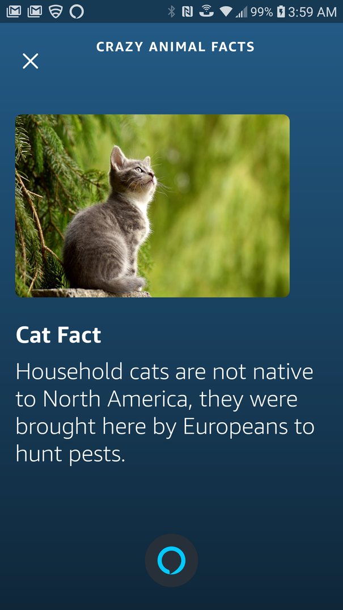

<h1 align="center"> Crazy-Animal-Facts </h1>

To invoke this Alexa skill, all you have to say is:

>"Alexa, open crazy animal facts."

If you wish to rate the skill, you can do so [here](https://www.amazon.com/Zachary-Owen-Crazy-Animal-Facts/dp/B07KG12D9P/ref=sr_1_1?keywords=crazy+animal+facts&qid=1584012676&s=digital-skills&sr=1-1). All feedback is welcomed, especially if it's constructive.

Here's an example (from my phone):

<!--  -->